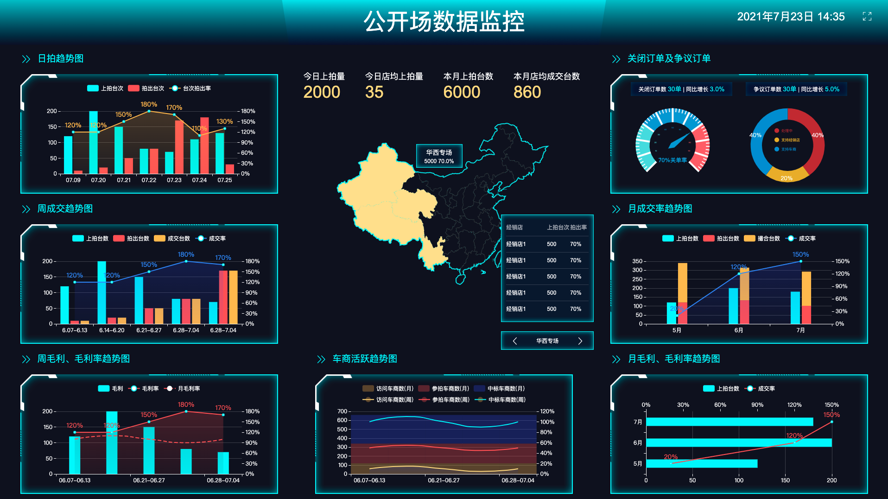

# eCharts 基础配置



## 主题配置

```json
{
  "color": [
    "#c12e34",
    "#e6b600",
    "#0098d9",
    "#2b821d",
    "#005eaa",
    "#339ca8",
    "#cda819",
    "#32a487"
  ],
  "backgroundColor": "rgba(12, 249, 255, 0)",
  "textStyle": {},
  "title": {
    "textStyle": {
      "color": "#7982a9",
      "fontWeight": "normal",
      "fontSize": "16px"
    },
    "subtextStyle": {
      "color": "#aaaaaa"
    }
  },
  "line": {
    "itemStyle": {
      "normal": {
        "borderWidth": 1
      }
    },
    "lineStyle": {
      "normal": {
        "width": 2
      }
    },
    "symbolSize": 4,
    "symbol": "emptyCircle",
    "smooth": false
  },
  "radar": {
    "itemStyle": {
      "normal": {
        "borderWidth": 1
      }
    },
    "lineStyle": {
      "normal": {
        "width": 2
      }
    },
    "symbolSize": 4,
    "symbol": "emptyCircle",
    "smooth": false
  },
  ...
}
```

## 地图配置

### map json 数据制作

> https://hxkj.vip/demo/echartsMap/

### 地图描边以及背景色配置

> 中国地图外部轮廓： geo.itemStyle

> 中国地图省份轮廓： series.itemStyle

> normal 为普通状态下的样式，emphasis 为选中状态下的样式 

```
const itemStyle = {
  color:"#fff",               // 颜色
  borderColor:"blue",         // 边框颜色
  borderWidth:0,              // 柱条的描边宽度，默认不描边。
  borderType:"solid",         // 柱条的描边类型，默认为实线，支持 'dashed', 'dotted'。
  barBorderRadius:10,         // 柱形边框圆角半径，单位px，支持传入数组分别指定柱形4个圆角半径。
  shadowBlur:10,              // 图形阴影的模糊大小。
  shadowColor:"#000",         // 阴影颜色
  shadowOffsetX:0,            // 阴影水平方向上的偏移距离。
  shadowOffsetY:0,            // 阴影垂直方向上的偏移距离。
  opacity:1,                  // 图形透明度。支持从 0 到 1 的数字，为 0 时不绘制该图形。
}

const options = {
  geo: {
    label: {
      normal: {
        show: false
      },
      emphasis: {
        show: false
      }
    },
    itemStyle: {
      normal: {
        areaColor: '#0c1022',
        label: { show: false }
      },
      emphasis: {
        areaColor: '#0c1022',
        label: { show: false }
      },
    },
  },
  series: {
    itemStyle: {
      normal: {
        areaColor: '#0c1022',
        label: { show: false }
      },
      emphasis: {
        areaColor: '#0c1022',
        label: { show: false }
      },
    },
  }
}
```

### 地图高亮部分省份

series.data

```js
const myItemStyle = {
  normal: {
    areaColor: 'rgba(255, 227, 144)',
    color: "rgba(255, 227, 144)",
    borderColor: "rgba(255, 227, 144)",
    borderWidth: 0,
    borderType: "solid",
    // opacity: .3,
    label: { show: false }
  },
  emphasis: {
    areaColor: 'rgba(255, 227, 144)',
    label: { show: false }
  },
}

series: [
  {
    name: '中国地图',
    type: 'map',
    mapType: 'CHINA',
    label: {
      show: false,
    },
    selectedMode: false,
    itemStyle: {
      normal: {
        areaColor: '#0c1022',
        label: { show: false }
      },
      emphasis: {
        areaColor: '#0c1022',
        label: { show: false }
      },
    },
    data: [
        {name: '广东省', value: 20057, itemStyle: myItemStyle},
        {name: '湖南省', value: 31686, itemStyle: myItemStyle},
        {name: '湖北省', value: 6992, itemStyle: myItemStyle},
        {name: '四川省', value: 44045, itemStyle: myItemStyle},
        {name: '河南省', value: 40689, itemStyle: myItemStyle},
        {name: '江西省', value: 37659, itemStyle: myItemStyle},
        {name: '福建省', value: 45180, itemStyle: myItemStyle},
        {name: '青海省', value: 55204, itemStyle: myItemStyle},
        {name: '西藏自治区', value: 21900, itemStyle: myItemStyle},
        {name: '新疆维吾尔自治区', value: 4918, itemStyle: myItemStyle},
        {name: '内蒙古自治区', value: 5881, itemStyle: myItemStyle},
        {name: '广西壮族自治区', value: 5881, itemStyle: myItemStyle},
        {name: '宁夏回族自治区', value: 5881, itemStyle: myItemStyle},
        {name: '云南省', value: 4178, itemStyle: myItemStyle},
        {name: '安徽省', value: 2227, itemStyle: myItemStyle},
        {name: '浙江省', value: 2180, itemStyle: myItemStyle},
        {name: '山东省', value: 9172, itemStyle: myItemStyle},
        {name: '黑龙江省', value: 9172, itemStyle: myItemStyle},
        {name: '江苏省', value: 9172, itemStyle: myItemStyle},
        {name: '贵州省', value: 9172, itemStyle: myItemStyle},
        {name: '吉林省', value: 9172, itemStyle: myItemStyle},
        {name: '辽宁省', value: 9172, itemStyle: myItemStyle},
        {name: '河北省', value: 9172, itemStyle: myItemStyle},
        {name: '甘肃省', value: 9172, itemStyle: myItemStyle},
        {name: '山西省', value: 9172, itemStyle: myItemStyle},
        {name: '海南省', value: 9172, itemStyle: myItemStyle},
        {name: '台湾省', value: 9172, itemStyle: myItemStyle},
        {name: '天津市', value: 9172, itemStyle: myItemStyle},
        {name: '北京市', value: 9172, itemStyle: myItemStyle},
        {name: '上海市', value: 9172, itemStyle: myItemStyle},
    ],
  }
]
```

## 通用配置说明

```js
const option = {
  // 设置图表离容器的边距
  grid: [{
    left: '8%',
    bottom: '15%',
    top: '30%',
    right: '8%'
  }],
  // x 轴坐标配置
  xAxis: {
    type: 'category',
    data: ['07.09', '07.20', '07.21', '07.22', '07.23', '07.24', '07.25']
  },
  // y 轴坐标配置
  yAxis: [
    {
      type: 'value',
      position: 'left',
      splitLine: {
        lineStyle: {
          color: 'rgba(255, 255, 255, .2)'
        },
        show: true // 背景网格
      }
    },
    {
      type: 'value',
      position: 'right',
      axisLabel: {  
        formatter: '{value}%'  
      }, 
    }
  ],
  // 图例组件展现了不同系列的标记，颜色和名字
  legend: {
    data: ['上拍台次', '拍出台次', '台次拍出率'],
    textStyle: {
      color: '#fff'
    },
    top: '5%'
  },
}
```

## 柱状图堆砌: stack

```js
const series = [
  {
    data: [120, 200, 180],
    name: '上拍台数',
    type: 'bar',
    barWidth: '15%',
    yAxisIndex: 0,
    showBackground: true,
    backgroundStyle: {
      color: 'rgba(12, 249, 255, 0)'
    },
  },
  {
    name: '拍出台数',
    type: 'bar',
    stack: 'Ad', // 堆砌
    barWidth: '15%',
    yAxisIndex: 0,
    emphasis: {
      focus: 'series'
    },
    backgroundStyle: {
      color: 'rgba(12, 249, 255, 0)'
    },
    itemStyle: {
      color: '#ff5a5a'
    },
    data: [120, 132, 101]
  },
  {
    name: '撮合台数',
    type: 'bar',
    stack: 'Ad', // 堆砌
    barWidth: '15%',
    yAxisIndex: 0,
    emphasis: {
      focus: 'series'
    },
    backgroundStyle: {
      color: '#ffc148'
    },
    itemStyle: {
      color: '#ffc148'
    },
    data: [220, 182, 191]
  },
]
```

## 折线图设置

阴隐： areaStyle

曲线：smooth

```js
const series = [{
  name: '成交率',
  type: 'line',
  yAxisIndex: 1,
  lineStyle: {
    color: '#4992ff'
  },
  // 阴隐
  areaStyle: {
    color: new echarts.graphic.LinearGradient(0, 0, 0, 1, [{
      offset: 0,
      color: 'rgba(58, 77, 233, 0.3)'
    }, {
      offset: 1,
      color: 'rgba(58, 77, 233, 0.1)'
    }])
  },
  data: [20, 120, 150],
  label: {
    show: true,
    position: 'top',
    formatter: '{c}%',
    textStyle: {
      align: 'center',
      fontSize: 14,
      color: '#4992ff',
      // 文字阴影，还可以设置背景块颜色和阴影
      textShadowColor: '#000',
      textShadowBlur: 4,
      textShadowOffsetX: 1,
      textShadowOffsetY: 1
    },
  },
}, {
  name: '月毛利率',
  type: 'line',
  smooth: 0.6, // 曲线
  symbol: 'none',
  yAxisIndex: 1,
  lineStyle: {
    color: '#ff5a5a',
    type: 'dashed'
  },
  data: [100, 110, 100, 90, 100],
  label: {
    show: false,
    position: 'top',
    formatter: '{c}%',
    textStyle: {
      align: 'center',
      fontSize: 14,
      color: '#4992ff'
    },
  },
}]
```

## 坐标轴样式设置：刻度、坐标轴颜色

```js
const xAxis = {
  type: 'category',
  data: ['11.19', '11.20', '11.21', '11.22', '11.23', '11.24', '11.25'],
  // 坐标轴刻度相关设置
  axisTick: {
    lineStyle: {
      color: 'transparent',
    }
  },
  // 坐标轴轴线相关设置
  axisLine: {
    lineStyle: {
      color: "rgba(255, 255, 255, .6)"
    }
  },
  // 坐标轴刻度标签的相关设置
  axisLabel: {
    textStyle: {
      fontSize: this.fontSize
    }
  },
}
```

## 图例组件 legend 设置

```js
const legend = {
  // icon: 'circle', 'rect', 'roundRect', 'triangle', 'diamond', 'pin', 'arrow', 'none'
  data: [
    { name: '上拍台次', icon: 'rect' }, 
    { name: '拍出台次', icon: 'rect' }, 
    { name: '台次拍出率' }, 
  ],
  // 文字字体大小和颜色，也可以设置背景和阴影
  textStyle: {
    color: '#fff',
    fontSize: this.fontSize
  },
  // 图例列表的布局朝向
  orient: 'horizontal',
  top: '5%'
}
```

## 仪表盘尺寸设置

> 刻度盘宽度 -> axisLine.lineStyle.width

> 长刻度线 -> axisTick: distance + length

> 短刻度线 -> splitLine: distance + length

> 刻度数字 -> axisLabel: distance

> 饼图的尺寸大小设置就比较简单，直接由内径和外径决定： radius: ['35%', '70%']

```js
const gauge = {
  type: 'gauge',
  center: ['25%', '60%'],
  radius: '70%',
  axisLine: {
    lineStyle: {
      // 仪表盘刻度盘宽度
      width: 15,
      // 仪表盘刻度盘颜色
      color: [
        [0.3, '#0CF9FF'],
        [0.7, '#4992ff'],
        [1, '#ff5a5a']
      ]
    }
  },
  pointer: {
    itemStyle: {
      color: 'auto'
    }
  },
  // 长刻度线设置
  axisTick: {
    // 长刻度线位置
    distance: -15,
    // 长刻度线长度
    length: 8,
    lineStyle: {
      color: '#fff',
      width: 1
    }
  },
  // 短刻度线设置
  splitLine: {
    // 短刻度线位置
    distance: -15,
    // 短刻度线长度
    length: 15,
    lineStyle: {
      color: '#fff',
      width: 1
    }
  },
  // 刻度数字设置
  axisLabel: {
    color: 'auto',
    // 刻度数字位置
    distance: 20,
    fontSize: 6
  },
  title: {
    show : true,
    offsetCenter: [0, '75%'],
    textStyle: {
      fontSize: 14,
      color: '#ff5a5a'
    }
  },
  detail: {
    valueAnimation: true,
    formatter: '{value}%',
    textStyle:{
      fontSize: 14,
      color: '#ff5a5a'
    },
    offsetCenter: [0, "50%"],
  },
  data: [{
    value: 70,
    name: '关单率',
  }]
}
```

## formatter

#### 字符串模板

- {a}：系列名。
- {b}：数据名。
- {c}：数据值。
- {@xxx}：数据中名为 'xxx' 的维度的值，如 {@product} 表示名为 'product' 的维度的值。
- {@[n]}：数据中维度 n 的值，如 {@[3]} 表示维度 3 的值，从 0 开始计数。

#### 回调函数

(params: Object|Array) => string

```js
const formatter = params => params.value === 0 ? `${params.value}%` : `${params.value.toFixed(1)}%`
```