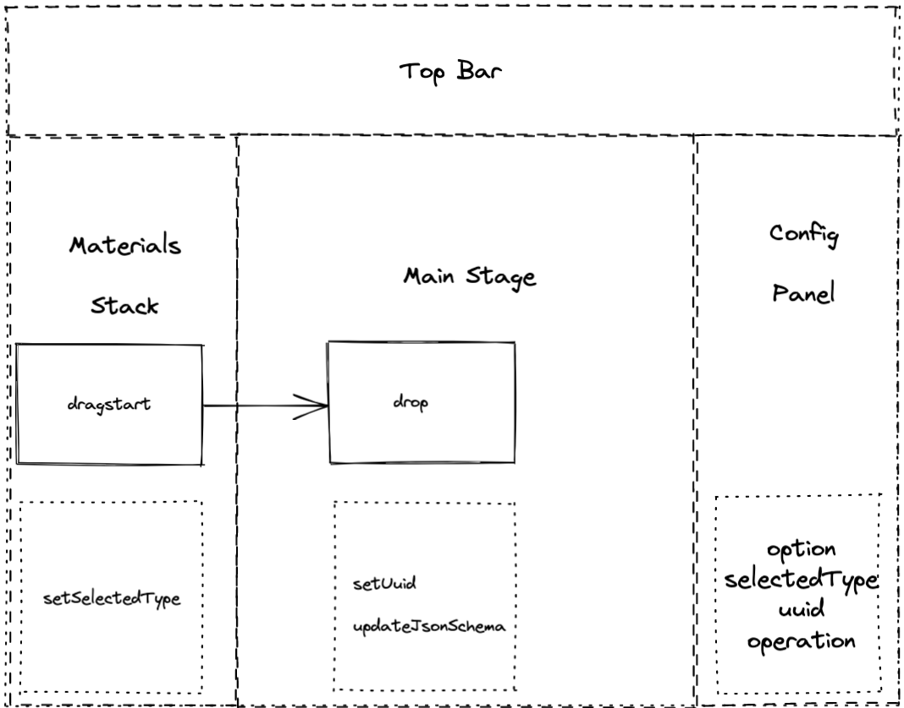
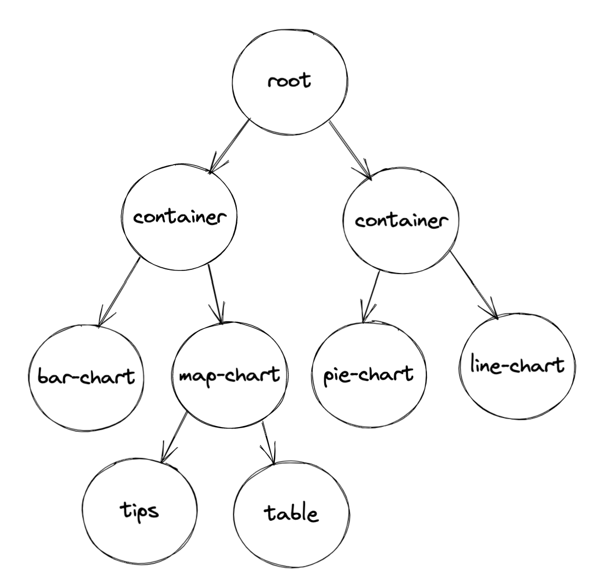

# 数据可视化低代码平台搭建

## 难点

> 如何动态引入组件库

> 组件数据分离，配置数据结构设计

> 如何递归渲染来实现组件嵌套

> 拖拽问题：1.物料堆拖拽到主舞台；2.组件在主舞台中的位置调整（目前还未实现）

> 配置面板人性化设计，如何抽离出需要修改的数据

## 四大组成部分



- 顶栏：标题 + 操作按钮

- 物料堆：物料图标 + 组件名称

- 主舞台：本质是渲染引擎，需要一次性全量引入所有组件

- 配置面板：本质是修改图表样式，部分逻辑可以转移到鼠标右击事件

## 动态引入组件库：全量引入

require.context(directory, useSubdirectories, regExp)

- directory: 表示检索的目录

- useSubdirectories: 表示是否检索子目录

- regExp: 匹配文件的正则表达式，一般是文件名

```js
const parseReq = require.context('./', true, /(.+)Parse\.ts/)

export const parsers = parseReq.keys().reduce((parsers, module) => {
  const mod = parseReq(module)
  parsers[mod.default.key] = mod.default
  return parsers
}, {})


// 测试 id, keys(), resolve(path) 和 parseReq(path)
const test = parseReq.keys().map(item => {
  const mod = parseReq(item)
  const resolve = parseReq.resolve(item)
  return {name: mod, resolve, item}
})

console.log({
  keys: parseReq.keys(),
  id: parseReq.id,
  test,
  parseReq
})
```

> parseReq 对象有三个属性：resolve, keys, id。当然，它本省也是一个函数:

- id 是 context module 里面所包含的模块 id。 
- keys() 是一个函数，它返回一个数组，就是相对 directory 的路径。
- resolve(path) 是一个函数，需要一个参数：keys()数组中的相对路径，它返回一个相对于根目录的路径（绝对路径）。
- parseReq(path) 是一个函数，需要一个参数：keys()数组中的相对路径，它返回模块内容：module.default/module.default.name【`此处尽量使用自己在模块中明确定义的静态属性，不要去使用 module.default.name 这种隐式属性`】。

## 递归渲染，组件嵌套



> 首先想到的是 jsx 的 render 函数: https://cn.vuejs.org/v2/guide/render-function.html#JSX

- 此处要注意区分 on 和 nativeOn 的区别：

  * on: 组件本身封装的方法，组件内部使用 `vm.$emit` 触发的事件。

  * nativeOn: 原生事件，类似于 native 修饰符：<comA @click.native="do()"></comA>

- 组件 render 函数的三个参数：

  * h: createElement 函数

  * section: 包含所有渲染组件需要的数据：图表类型、数据、标题、样式、拖拽事件和唯一标识 uuid

  * children: 子组件，类似于 模板组件的 slot，这个参数可以实现组件嵌套

```js
// 组件
class ChartBoxParse extends Vue {
  static options: any = options

  render (h, section, children) {
    const options = handleOptionsData(section.section.option.options)
    const _props = {
      props: {
        jsonSchema: section.section,
        // @ts-ignore
        title: options.cssStyle.title,
        cssStyle: options.cssStyle,
      }
    }
    const _propsOn = {
      on: {
        dragover: section.handleDragOver,
        drop: section.handleDrop
      },
      nativeOn: {
        click: (e) => {
          e.stopPropagation()
          store.dispatch('biCharts/setSelectedType', {
            selectedType: 'ChartBoxParse'
          })
          store.dispatch('biCharts/setUuid', {
            uuid: section.section.uuid,
          })
        }
      }
    }
    return (
      <ChartBox
        { ..._props }
        { ..._propsOn }
      >{ children }</ChartBox>
    )
  }
}
```

```js
// 渲染引擎
export default class RenderEngine extends Vue {
  @biCharts.Action('setSelectedType') setSelectedType
  @biCharts.Action('setUuid') setUuid
  @biCharts.State('selectedType') selectedType
  @Prop({default: () => ({})}) jsonSchema

  // 渲染根节点
  renderRoot (h) {
    // TODO: 后期丰富全局配置逻辑入口
    return (
      <div class="root">
        { this.renderComponents(h, this.jsonSchema) }
      </div>
    )
  }

  // 渲染组件
  renderComponents (h, section) {
    // 组件通用逻辑在此处理
    // 是否有子节点
    let _children = null

    if (section.children) {
      // 层级渲染
      _children = this.renderChildren(h, section)
    }
    return this.startRender(h, section, _children)
  }

  // 遍历包含兄弟&子节点
  renderChildren (h, section) {
    let _nodeArray = section.children || [].concat(section)
    // 后期可以在此拓展兄弟节点之间通信
    return _nodeArray.map((n, i) => this.renderComponents(h, n, i))
  }

  // 开始渲染
  startRender (h, section, _children) {
    // console.log({ section })
    const _type = section.type
    const renderMod = parsers[_type]

    // 直接渲染
    if (renderMod) {
      return renderMod.extendOptions.render(h,
        {
          section,
          handleDrop: this.handleDrop,
          handleDragOver: this.handleDragOver
        }, _children)
      
    }
    return null
  }

  // 以下为配置系统统一化处理逻辑
  // 拖拽组件经过触发
  handleDragOver () {
    // TODO: 拖拽组件经过容器组件时触发高亮效果
  }
  // 拖拽组件松手
  handleDrop (event, vm) {
    const _json = vm.jsonSchema

    if (_json && (_json.type.includes('Container') || _json.type.includes('Map') || _json.type.includes('Box'))) {
      if (!_json.children) {
        this.$set(_json, 'children', [])
      }
      const uuid = uuidv4()
      _json.children.push({
        type: this.selectedType,
        option: parsers[this.selectedType].options,
        uuid,
      })

      this.setUuid({ uuid })
    }
  }
  render (h) {
    let _vode = this.renderRoot(h)
    return _vode
  }
}
```
## 拖拽

> 暂时使用原生拖拽事件，后续可优化： https://github.com/SortableJS/Vue.Draggable

## 主舞台和渲染引擎的思考

- 两种做法：1. 所见即所得，渲染引擎一体化；2. 多态舞台，分开维护。

- 所见即所得，渲染引擎一体化的特点：配置前后的差异小，维护成本低，主舞台和渲染引擎是一套代码，但是复杂度比较高，逻辑集成度高。

- 多态舞台，分开维护的特点：分开两拨人维护对用的主舞台和渲染引擎，效率高，逻辑相对简单，但配置前后会有差异问题。

- 折中方案：采用所见即所得的方案，在渲染引擎进行数据渲染之前先对数据进行预处理，并将预处理流程单独抽离。数据预处理要做的事情：1. 去掉拖拽事件；2. 去掉 dragover 或者选中时候的样式。
