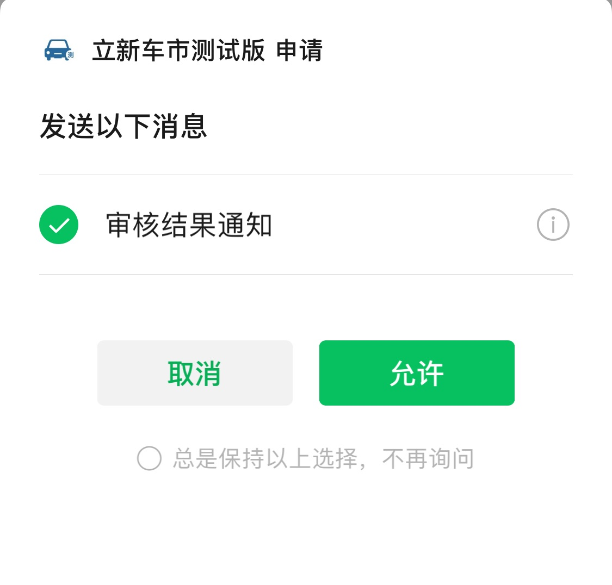

# 模板消息订阅

## step-1: 微信后台配置订阅消息模板

> 微信后台 - 功能 - 订阅消息 - 我的模板

## step-2: 通过接口动态获取订阅消息模板 id

> 开发过程测试，可以直接在微信后台复制模板 id

```js
const { code, data: subscribeTmpl, message } = await this.$rest.subscribe.getSubscribeTmpl()
if (code !== 0) {
  wx.showModal({
    content: message || this.i18N.getTemError,
    showCancel: false
  })
  return
}
const { review_result: reviewResult } = subscribeTmpl
const tmplIds = [ reviewResult ]
```

## step-3: 将模板 id 作为参数调起客户端小程序订阅消息界面，返回用户订阅消息的操作结果。

> 文档地址：https://developers.weixin.qq.com/miniprogram/dev/api/open-api/subscribe-message/wx.requestSubscribeMessage.html

> 用户订阅成功的判断条件：errMsg === 'requestSubscribeMessage:ok' && res[reviewResult] === 'accept'



```js
wx.requestSubscribeMessage({
  tmplIds: tmplIds,
  success: async (res) => {
    const { errMsg } = res
    if (errMsg === 'requestSubscribeMessage:ok' && res[reviewResult] === 'accept') {
      wx.showModal({
        title: this.i18N.tipsTitle,
        content: '订阅成功',
        showCancel: false
      })
    } else {
      wx.showModal({
        title: this.i18N.tipsTitle,
        content: '订阅失败',
        showCancel: false
      })
    }
  },
  fail: (res) => {
    console.log('fail', res)
  },
  complete: () => {
    this.statusCode = 'DATA_UPLOADED'
    this.currentStatus = 2
    this.$apply()
  }
})
```