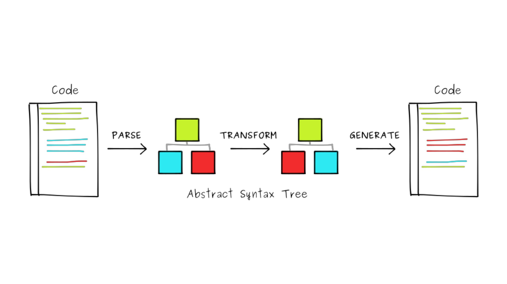

## markdown 常用语法

> 字体、字号、颜色

- 黑体

> 表格

项目     | 价格
-------- | ---
Computer | $1600
Phone    | $12
Pipe     | $1

> 图片

> 分割线

---
***
___

> 标题：Setext方式

大标题
===
小标题
---

> 嵌套列表

- 嵌套列表1
 + 嵌套列表2
 + 嵌套列表3
  - 嵌套列表4
   * 嵌套列表5
- 嵌套列表6

> 强调：星号与下划线都可以，单是斜体，双是粗体

**一个人来到田纳西**

__毫无疑问__
 
*我做的馅饼是全天下*
 
_最好吃的_

> 引用

>引用
  >>引用中的引用