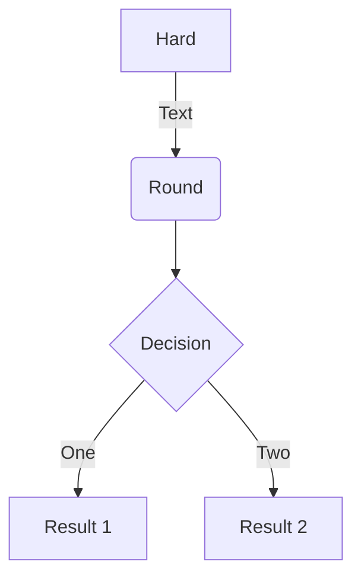
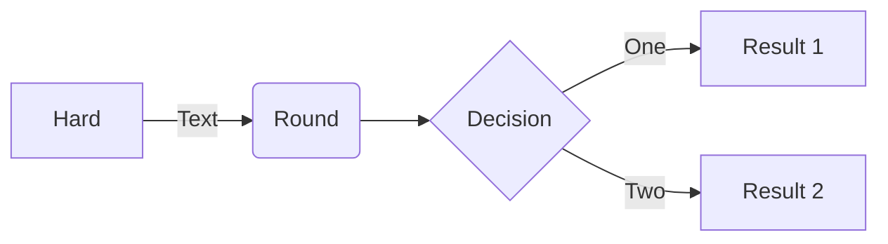
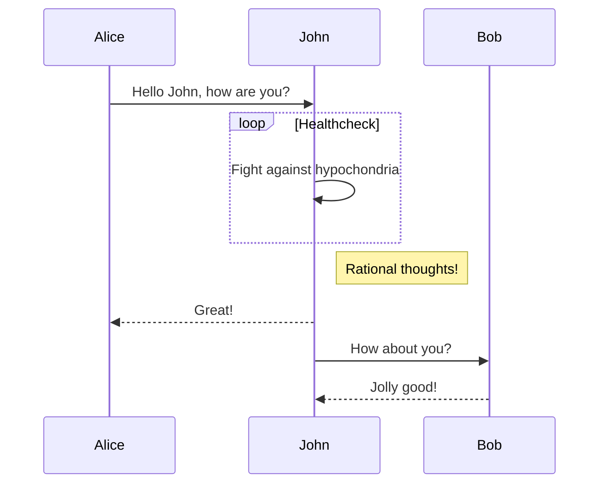
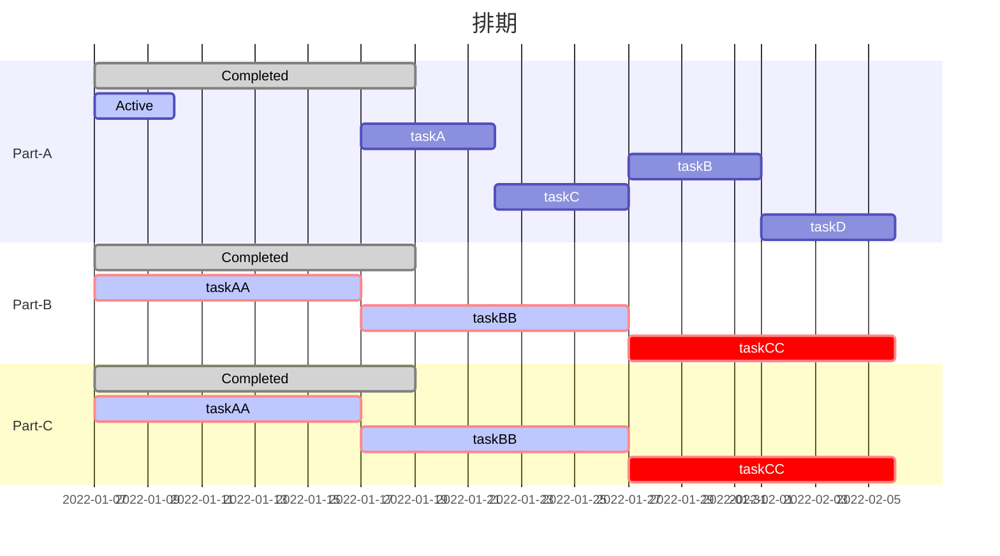
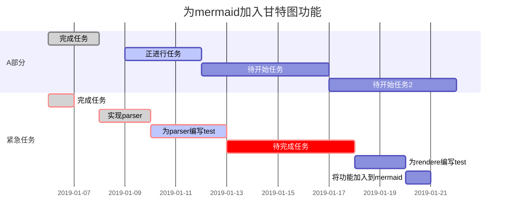

# mermaid-gb3

## Flow 流程图

```mermaid
graph TD
A[Hard] -->|Text| B(Round)
B --> C{Decision}
C -->|One| D[Result 1]
C -->|Two| E[Result 2]
```

```mermaid
graph LR
A[Hard] -->|Text| B(Round)
B --> C{Decision}
C -->|One| D[Result 1]
C -->|Two| E[Result 2]
```

## Sequence 时序图

```mermaid
sequenceDiagram
Alice->>John: Hello John, how are you?
loop Healthcheck
    John->>John: Fight against hypochondria
end
Note right of John: Rational thoughts!
John-->>Alice: Great!
John->>Bob: How about you?
Bob-->>John: Jolly good!
```

## Gantt 甘特图

```mermaid
gantt
    title 排期
    dateFormat YYYY-MM-DD
    section Part-A
    Completed: done, des1, 2022-01-07,2022-01-19
    Active: active, des2, 2022-01-07, 3d
    taskA: des3, after des1, 5d
    taskB: des4, after des2, 5d
    taskC: des5, after des3, 5d
    taskD: des6, after des4, 5d
    section Part-B
    Completed: done, des1, 2022-01-07,2022-01-19
    taskAA: crit, active, des1, 2022-01-07, 10d
    taskBB: crit, active, des2, after des1 , 10d
    taskCC: crit, after des2, 10d
    section Part-C
    Completed: done, des1, 2022-01-07,2022-01-19
    taskAA: crit, active, des1, 2022-01-07, 10d
    taskBB: crit, active, des2, after des1 , 10d
    taskCC: crit, after des2, 10d
```

```mermaid
gantt
    dateFormat  YYYY-MM-DD
    title 为mermaid加入甘特图功能
    section A部分
    完成任务        :done, des1,2019-01-06,2019-01-08
    正进行任务      :active, des2,2019-01-09,3d
    待开始任务      :des3, after des2, 5d
    待开始任务2     :des4, after des3, 5d
    section 紧急任务
    完成任务        :crit,done,2019-01-06,24h
    实现parser     :crit,done,after des1, 2d
    为parser编写test :crit, active, 3d
    待完成任务      :crit,5d
    为rendere编写test: 2d
    将功能加入到mermaid: 1d
```

