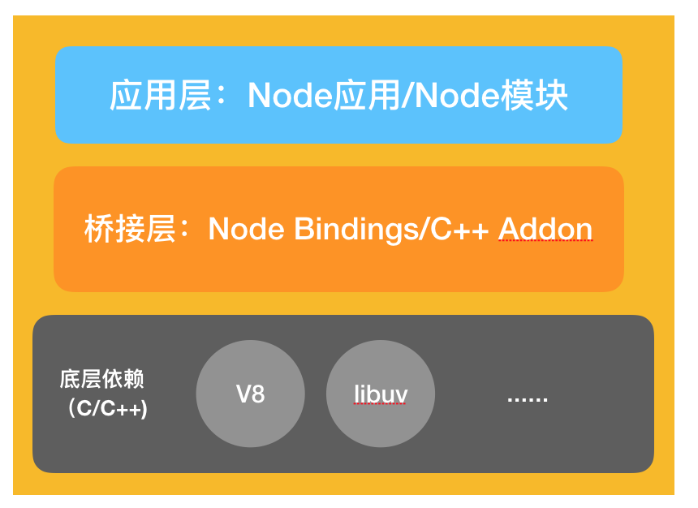

# 你了解浏览器的事件循环吗？

## 1. 为什么js在浏览器中有事件循环机制？

js是单线程的 event loop

## 2. 有哪两种任务？
- 宏任务：整体代码，setTimeout，setInterval，setImmediate(node + ie)，MessageChannel，requestAnimationFrame,I/O操作，UI rendering，script（整体代码）

- 微任务：new Promise().then，queueMicrotask，MutationObserver(监听 dom 更新)，process.nextTick(node)

## 3. 为什么要引入微任务的概念，只有宏任务可以吗？
宏任务：先进先出，每执行一个宏任务后都会把所有的微任务清掉，就是插队。

## 4. 一个完整的 Event Loop 过程，包括哪些阶段？

- a. 执行并出队一个 macro-task。注意如果是初始状态：调用栈空。micro 队列空，macro 队列里有且只有一个 script 脚本（整体代码）。这时首先执行并出队的就是 script 脚本；

- b. 全局上下文（script 标签）被推入调用栈，同步代码执行。在执行的过程中，通过对一些接口的调用，可以产生新的 macro-task 与 micro-task，它们会分别被推入各自的任务队列里。这个过程本质上是队列的 macro-task 的执行和出队的过程；

- c. 上一步我们出队的是一个 macro-task，这一步我们处理的是 micro-task。但需要注意的是：当 macro-task 出队时，任务是一个一个执行的；而 micro-task 出队时，任务是一队一队执行的（如下图所示）。因此，我们处理 micro 队列这一步，会逐个执行队列中的任务并把它出队，直到队列被清空；

- d. 执行渲染操作，更新界面；

- e. 检查是否存在 Web worker 任务，如果有，则对其进行处理。

## 5. Node中的事件循环和浏览器中的事件循环有什么区别？

> node v10 之后与浏览器中的事件循环趋同，<font color=red>这里的趋同指的是宏任务的执行机制。</font>v10 之前不一样。

> <font color=red>node v10 之前，清空当前阶段对应宏任务队列里的所有任务，而浏览器的宏任务队列是一个一个清空的，每个宏任务之间，还会去清空微任务队列。</font>

#### Node 三个组成部分



- 应用层：这一层就是我们最熟悉的 Node.js 代码，包括 Node 应用以及一些标准库。

- 桥接层：Node 底层是用 C++ 来实现的。桥接层负责封装底层依赖的 C++ 模块的能力，将其简化为 API 向应用层提供服务。

- 底层依赖：这里就是最最底层的 C++ 库了，支撑 Node 运行的最基本能力在此汇聚。其中需要特别引起我们注意的就是 V8 和 libuv：

  * V8 是 JS 的运行引擎，它负责把 JavaScript 代码转换成 C++，然后去跑这层 C++ 代码。
  
  * libuv：它对跨平台的异步I/O能力进行封装，Node 中的事件循环就是由 `libuv` 来初始化的。

#### libuv 中的 Event-Loop 实现

> https://nodejs.org/zh-cn/docs/guides/event-loop-timers-and-nexttick/


- timers（定时器阶段）：执行 setTimeout 和 setInterval 中定义的回调；

- pending callbacks（待定回调阶段）：直译过来是“被挂起的回调”，如果网络I/O或者文件I/O的过程中出现了错误，就会在这个阶段处理错误的回调（比较少见，可以略过）；

- idle, prepare：仅系统内部使用。这个阶段我们开发者不需要操心。（可以略过）；

- poll（轮询阶段）：重点阶段，这个阶段会执行I/O回调，同时还会检查定时器是否到期；

- check（检查阶段）：处理 setImmediate 中定义的回调；

- close callbacks（关闭回调函数阶段）：处理一些“关闭”的回调，比如socket.on('close', ...)就会在这个阶段被触发。

#### Node 事件循环各个阶段

- a. 执行全局的 Script 代码（与浏览器无差）；

- b. 把微任务队列清空：注意，Node 清空微任务队列的手法比较特别。<font color=#0099ff size=12 face="黑体">在浏览器中，我们只有一个微任务队列需要接受处理；但在 Node 中，有两类微任务队列：next-tick 队列和其它队列。其中这个 next-tick 队列，专门用来收敛 `process.nextTick` 派发的异步任务。在清空队列时，优先清空 next-tick 队列中的任务，随后才会清空其它微任务；</font>

- c. 开始执行 macro-task（宏任务）。注意，Node 执行宏任务的方式与浏览器不同：在浏览器中，我们每次出队并执行一个宏任务；而在 Node 中，我们每次会尝试清空当前阶段对应宏任务队列里的所有任务（除非达到了系统限制），v10 之后与浏览器一致了；

#### Poll 阶段对定时器的处理

- poll 队列不为空。直接逐个执行队列内的回调并出队、直到队列被清空（或者到达系统上限）为止；

- poll 队列本来就是空的。它首先会检查有没有待执行的 setImmediate 任务，如果有，则往下走、进入到 check 阶段开始处理 setImmediate；如果没有 setImmediate 任务，那么再去检查一下有没有到期的 setTimeout 任务需要处理，若有，则跳转到 timers 阶段。

## 6. 什么是 MutationObserver？

> Mutation Observer API 用来监视 DOM 变动。比如节点的增减、属性的变动、文本内容的变动。它是一个微任务。

> 当你使用 observer 监听多个 DOM 变化时，并且这若干个 DOM 发生了变化，那么 observer 会将变化记录到变化数组中，等待一起都结束了，然后一次性的从变化数组中执行其对应的回调函数。

```js
// Firefox和Chrome早期版本中带有前缀
const MutationObserver = window.MutationObserver || window.WebKitMutationObserver || window.MozMutationObserver
// 选择目标节点
const target = this.$refs.bi;
// 创建观察者对象
const observer = new MutationObserver(function(mutations) {  
  mutations.forEach(function(mutation) { 
    console.log('mutation', mutation); 
  }); 
}); 
// 配置观察选项:
const config = { attributes: true, childList: true, characterData: true, attributeFilter: ['class', 'id'] } 
// 传入目标节点和观察选项
observer.observe(target, config); 
// 停止观察
// observer.disconnect();
```

> config 参数

|  属性   | 描述  |
|  ----  | ----  |
| childList  | 子节点 |
| attributes  | 属性 |
| characterData  | 节点内容或节点文本 |
| subtree  | 后代节点 |
| attributeOldValue  | 表示观察attributes变动时，是否需要记录变动前的属性值 |
| characterDataOldValue  | 表示观察characterData变动时，是否需要记录变动前的值 |
| attributeFilter  | 特定属性 |

【除了 attributeFilter 的类型为数组，其他参数均为布尔值】

> MutationRecord 对象 [例子中打印的 mutation]

```
type：观察的变动类型（attribute、characterData或者childList）。
target：发生变动的DOM节点。
addedNodes：新增的DOM节点。
removedNodes：删除的DOM节点。
previousSibling：前一个同级节点，如果没有则返回null。
nextSibling：下一个同级节点，如果没有则返回null。
attributeName：发生变动的属性。如果设置了attributeFilter，则只返回预先指定的属性。
oldValue：变动前的值。这个属性只对attribute和characterData变动有效，如果发生childList变动，则返回null。
```