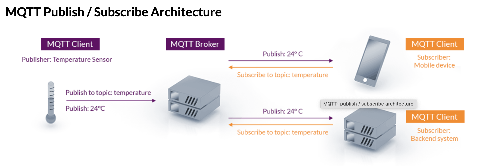

# MQTT

> MQTT（Message Queuing Telemetry Transport）是一种轻量级的消息传递协议，旨在在低带宽、不稳定网络环境下实现高效的设备间通信。MQTT 最初是为物联网（IoT）设备设计的。

## mqtt 发布订阅模式



一个设备（发布者）可以将消息发布到一个特定的主题，而其他设备（订阅者）可以订阅相同的主题来接收消息。这使得设备之间可以实现异步通信，并支持多对多的通信。

## mqtt 代码举例

```js
import * as mqtt from 'mqtt'

const { VITE_MQTT_BROKER_URL, VITE_MQTT_USERNAME, VITE_MQTT_PASSWORD } = import.meta.env

const mqttDeviceClient = mqtt.connect(VITE_MQTT_BROKER_URL, {
  username: VITE_MQTT_USERNAME,
  password: VITE_MQTT_PASSWORD,
  keepalive: 30,
  connectTimeout: 60 * 1000
})

const deviceTopic = `/real-time-medical-device-status-history-production/${hospitalId}`
mqttDeviceClient.on('connect', () => {
  mqttDeviceClient!.subscribe(deviceTopic)
})
mqttDeviceClient.on('message', (topic, message) => {
  if (device.value === null) return
  const action = JSON.parse(message.toString())
  switch (action.dataType) {
    // 机器人底盘
    case 'ROBOT':
      if (action.floorName === floorName) {
        const robot = group.getObjectByName(action.name)
        const center = originData[`${process.env.place}`][action.floorName]
        const [x, z] = calWankeDedivation(action.coordinates, center)
      }
      break

    // 柜子
    case 'HIVE':
      if (action.floorName === floorName) {
        const hive = group.getObjectByName(action.name)
        const center = originData[`${process.env.place}`][action.floorName]
        const [x, z] = calWankeDedivation(action.coordinates, center)
      }
      break

    // 充电桩
    case 'DOCK':
      device.value.dockList.forEach((item: any, index: number) => {
        if (item.id === action.id && device.value) {
          device.value.dockList[index] = action
        }
      })
      break

    default:
      break
  }
})
// 本地调试 MQTT 成本控制
setTimeout(() => {
  mqttDeviceClient?.end()
}, 1200000)
```

## mqtt 与 WebSocket 的区别

1. 应用场景：

  - MQTT：主要用于物联网（IoT）领域，特别是在低带宽、不稳定网络环境下的设备间通信。MQTT 专注于高效的消息传递和订阅发布模式，适用于需要实时推送和异步通信的场景。
  - WebSocket：用于在 Web 应用程序中实现双向通信，允许服务器和客户端之间建立持久性的连接，实时地传递数据。适用于需要实时更新、实时聊天和多人协作等场景。

2. 通信模式：

  - MQTT：支持发布-订阅模式，其中一个设备可以将消息发布到一个特定的主题，其他设备可以订阅相同主题来接收消息。这种模式适合广播消息和多对多通信。
  - WebSocket：提供全双工双向通信，客户端和服务器可以同时发送和接收数据，适合双向的实时通信。

3. 连接性：

  - MQTT：通常在连接时会经过一些握手和协商，然后保持长时间的持久连接，以便实现设备之间的实时通信。
  - WebSocket：使用单个 TCP 连接来实现持久的双向通信，适用于客户端和服务器之间需要频繁通信的情况。

4. 数据格式：

  - MQTT：可以传输任何格式的数据，通常使用二进制数据，但也可以使用 JSON 等格式。
  - WebSocket：传输的数据可以是文本（如 JSON、XML）或二进制数据。

5. 协议特点：

  - MQTT：具有轻量级、消息传递确认、保留消息、QoS 等级等特点，非常适合资源有限的设备和网络。
  - WebSocket：是基于 HTTP 协议的，具有更大的灵活性和实时性，适合用于 Web 应用程序中的实时通信。

总结： MQTT 适用于物联网领域，特别是需要低带宽、高效传输和订阅发布模式的场景。WebSocket 适用于 Web 应用程序中的实时通信，支持双向通信和持久连接。
