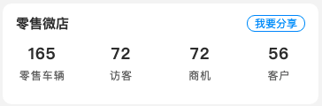
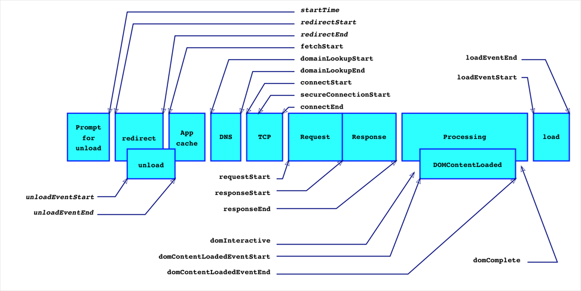

# 如何提升性能？

### 1.数据处理优先：先过滤数据，避免渲染的时候使用条件判断

> 这样处理数据可以规避 v-for 与 v-if 同时出现的尴尬场景



#### a.渲染的时候使用条件判断 ❎

```html
<div
  class="manage-car-retail"
  v-if="hasRetailAuth && hasMicroShopAuth">
  <x-cell
    x-class="cell-box"
  >
    <div class="manage-car-retail__header">零售微店</div>
    <view
      slot="footer"
      class="manage-car-retail__share"
      @click="handleShare"
    >我要分享</view>
  </x-cell>
  <div class="manage-car-retail__body">
    <div
      class="manage-car-retail__item"
      v-for="item in retailInfo"
      :key="item.id"
      v-if="item.value !== null"
    >
      <div @click="handleJump(item)">
        <p class="manage-car-retail__value">{{ item.value }}</p>
        <p class="manage-car-retail__name">{{ item.name }}</p>
      </div>
    </div>
  </div>
</div>
```

#### b.过滤数据 ✅

```js
methods: {
  async fetchMicroShopManage() {
    const {code, data} = await this.$rest.microShop.fetchMicroShopManage()
    if (code === 0) {
      this.retailInfo = data.map(item => item.value !== null)
    }
  }
}
```

### 2.iconfont 制作

> svg 转 iconfont, 生成字体文件的同时，生成 less 文件，方便组件使用

> 手动制作地址：https://icomoon.io/app/#/select

  - 防止错乱：导入原项目的 svg 文件后，先生成 font，再添加新的 svg 图标。

#### gulpfile.js 文件

```js
const gulp = require('gulp')
const iconfont = require('gulp-iconfont')
const iconfontCss = require('gulp-iconfont-css')
const fontIconVersion = require('./package.json').fontIconVersion

const generateIconfont = () => {
  return gulp
    .src(['./svg-icon/**/*.svg'])
    .pipe(iconfontCss({
      fontName: 'lxSvgFont.' + fontIconVersion,
      cssClass: 'lx-icon',
      path: './svg-icon/template.less',
      targetPath: '../fonticon/icon.less'
    }))
    .pipe(iconfont({
      fontName: 'lxSvgFont.' + fontIconVersion,
      prependUnicode: true,
      formats: ['ttf', 'eot', 'woff'],
      timestamp: Math.round(Date.now() / 1000)
    }))
    .pipe(gulp.dest('./lx-svg-font/'))
}

exports.default = generateIconfont
```

#### 组件

```html
<template>
  <span v-show="iconLoaded" :class="'lx-icon-' + iconName + ' ' + xClass" @click="handleOnClick"></span>
</template>

<script>
export default {
  props: {
    iconName: {
      type: String,
      default: ''
    },
    xClass: {
      type: String,
      default: ''
    }
  },
  data() {
    return {
      iconLoaded: true
    }
  },
  onLoad () {
  },
  methods: {
    handleOnClick () {
      this.$emit('handleOnClick')
    }
  }
}
</script>

<style lang='less'>
@font-face {
  font-family: "lxSvgFont";
  src: url('@cdnUrl/static/lx-svg-font/@fontIconName.woff');
}
@import url('./icon.less');
</style>
```

### 3.css3 动画和 js 动画性能对比

> css3 动画

- CSS 动画运行在 GPU。

- CSS3 动画也被称为补间动画，原因是只需要添加关键帧的位置，其他的未定义的帧会被自动生成。

- 浏览器可以对动画进行优化，帧速不好的浏览器，CSS3 可以自然降级兼容。

- 只设置了几个关键帧的位置，不能再半路暂停动画。

> js 动画

- JS 动画运行在 CPU。

- JS 动画是逐帧动画，在时间帧上绘制内容，一帧一帧的，所以他的可再造性很高，几乎可以完成任何你想要的动画形式。

- 逐帧动画的内容不一样，会增加制作的负担，占用比较大的资源空间。

- 细腻的动画，可控性高。

> 结论：只要能用 CSS 实现的动画，就不要采用 JS 去实现。

### 4.前端性能分析

> 思路：根据具体指标分析，解决前20%的问题，提升80%的性能。

> lighthouse

#### 前端性能指标



> ⽩屏时间 FP(First Paint): 指的是当我输⼊URL开始，到⻚⾯开始有变化，只要有任意像素点变化，都算是⽩屏时间的完结。

> ⾸次内容绘制 FCP(First Contentful Paint): 指的是⻚⾯上绘制了第⼀个元素。

> ⾸次有效绘制 FMP: 指的是⻚⾯中有效内容绘制。

> 最⼤内容绘制 LCP(Largest Contentful Paint): ⽤于记录视窗内最⼤的元素绘制的时间，该时间会随着⻚⾯渲染变化⽽变化，因为⻚⾯中的最⼤元素在渲染过程中可能会发⽣改变，另外该指标会在⽤户第⼀次交互后停⽌记录。

> ⾸次可交互时间 TTI(Time to Interactive)

1. 从 FCP 指标后开始计算
2. 持续 5 秒内⽆⻓任务（执⾏时间超过 50 ms）且⽆两个以上正在进⾏中的 GET 请求
3. 往前回溯⾄ 5 秒前的最后⼀个⻓任务结束的时间

#### 前端框架检测工具

> web-vitals ：是⼀个前端框架，他可以不需要你书写上⾯代码只需要轻松的引⽤即可, https://www.npmjs.com/package/web-vitals。

> 缺点是：⽬前只能统计 'CLS' | 'FCP' | 'FID' | 'LCP' | 'TTFB' 

> 在⾕歌的标准中，⼀般我们只需要关⼼以上⼏个，分别是LCP, FID, CLS;

#### 影响性能的因素

* 影响⽩屏的时间

  - ⽹速问题

  - JS包⼤⼩问题

  - 是否启⽤了JS异步加载

* 解决⽅案

  - 提⾼带宽

  - 需要使⽤webpack进⾏tree-shaking

  - 使⽤路由懒加载，只有在使⽤的时候在进⾏路由加载

  - 尽量使⽤CDN进⾏加速

  - 建⽴缓存，提⾼下次加载速度

  - 开启gzip压缩

## `chrome` 浏览器 `Network` 面板请求 `Timing` 分析

- Queueing

  > 请求文件顺序的排序。浏览器是有线程限制的，发请求也不能所有的请求同时发送，会将请求加入队列中（Chrome的最大并发连接数是6）。此参数表示从添加到待处理队列，到实际开始处理的时间间隔标示。

- Stalled（阻塞)

  > 浏览器得到要发出这个请求的指令，到请求可以发出的等待时间，一般是代理协商、以及等待可复用的TCP连接释放的时间，不包括DNS查询、建立TCP连接等时间等。浏览器对同一个主机域名的并发连接数有限制，因此如果当前的连接数已经超过上限，那么其余请求就会被阻塞，等待新的可用连接；此外脚本也会阻塞其他组件的下载；

  > 优化措施：

  * 1、将资源合理分布到多台主机上，可以提高并发数，但是增加并行下载数量也会增大开销，这取决于带宽和CPU速度，过多的并行下载会降低性能；

  * 2、脚本置于页面底部；

- DNS Lookup

  > 请求某域名下的资源，浏览器需要先通过DNS解析器得到该域名服务器的IP地址。在DNS查找完成之前，浏览器不能从主机名那里下载到任何东西。DNS查询的时间，当本地DNS缓存没有的时候，这个时间可能是有一段长度的，但是比如你一旦在host中设置了DNS，或者第二次访问，由于浏览器的DNS缓存还在，这个时间就为0了。

  > 优化措施：

  * 1、利用DNS缓存（设置TTL时间）；

  * 2、利用Connection:keep-alive特性建立持久连接，可以在当前连接上进行多个请求，无需再进行域名解析；

- Initial connection

  > 建立TCP连接的时间，就相当于客户端从发请求开始到TCP握手结束这一段，包括DNS查询+Proxy时间+TCP握手时间。

- SSL

  > http是超文本传输协议，以明文方式发送内容，不提供任何方式的数据加密，如果被不法分子截取浏览器和服务器之间的传输报文，会获取其中的信息。

  > https 是安全套接字层超文本传输协议，就是在HTTP的基础上加入了SSL协议，SSL依靠证书来验证服务器的身份，并为浏览器和服务器之间的通信加密。因此建立HTTPS连接的时间相当于三次握手的时间+SSL时间。

- Request sent

  > 发送HTTP请求的时间（从第一个字节发出前到最后一个字节发出后的时间

  > 优化措施：

  * 1、减少HTTP请求，可以使用CSS Sprites、内联图片、合并脚本和样式表等；

  * 2、对不常变化的组件添加长久的Expires头（相当于设置久远的过期时间），在后续的页面浏览中可以避免不必要的HTTP请求；

- Waiting for server response

  > 请求发出后，到收到响应的第一个字节所花费的时间(Time To First Byte)，发送请求完毕到接收请求开始的时间；通常是耗费时间最长的。从发送请求到收到服务器响应的第一字节之间的时间，受到线路、服务器距离等因素的影响。注意：网页重定向越多，TTFB越高，所以要减少重定向。

  > 优化措施: 使用CDN，将用户的访问指向距离最近的工作正常的缓存服务器上，由缓存服务器直接响应用户请求，提高响应速度；能使用第三方的 CDN 资源直接使用，不能使用的可以通过 webpack 的 dllPlugin 和 dllReferencePlugin 生成动态链接库，然后手动放到 CDN 上面。

- Content Download

  > 收到响应的第一个字节，到接受完最后一个字节的时间，就是下载时间。

  > 优化措施：

  * 1、通过条件Get请求，对比If-Modified-Since和Last-Modified时间，确定是否使用缓存中的组件，服务器会返回“304 Not Modified”状态码，减小响应的大小；

  * 2、移除重复脚本，精简和压缩代码，如借助自动化构建工具grunt、gulp等；

  * 3、压缩响应内容，服务器端启用gzip压缩，可以减少下载时间；

  * 4、使用 webpack splitChunks 抽离公共代码减少主包体积

