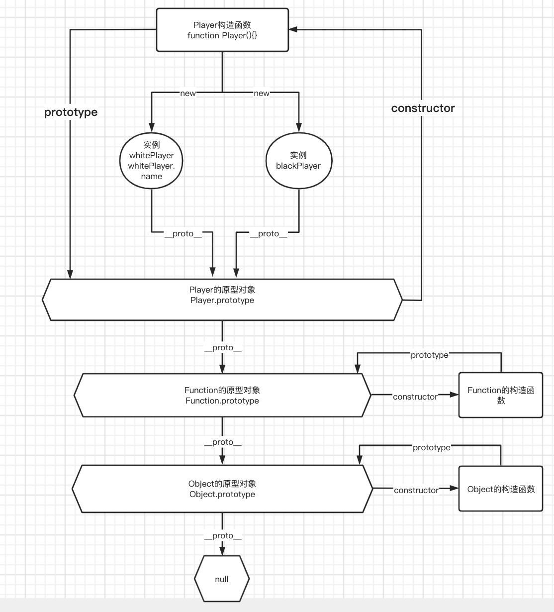

# 原型及原型链

## 几个概念

- 构造函数: 用 new 关键字来调用的函数

- 实例：构造函数用 new 关键字实例化的结果

- new 关键字干了啥？(const whitePlayer = new Player())
  1. 一个继承自 Player.prototype 的新对象 whitePlayer 被创建
  2. whitePlayer.**`__proto__`** 指向 Player.prototype，即 whitePlayer.**`__proto__`** = Player.prototype
  3. 将 this 指向新创建的对象 whitePlayer
  4. 返回新对象
    * 4.1 如果构造函数没有显式返回值，则返回 this
    * 4.2 如果构造函数有显式返回值，是基本类型，比如 number,string,boolean, 那么还是返回 this
    * 4.3 如果构造函数有显式返回值，是对象类型，比如{ a: 1 }, 则返回这个对象{ a: 1 }

## 原型链的理解

实例的 `__proto__` 指向构造函数的 `prototype`



## es5 继承

```js
function Rectangle(height, width) {
  this.name = 'Rectangle';
  this.height = height;
  this.width = width;

  this.getName = function() {
    console.log('name:', this.name);
  }

  this.getArea = function() {
    console.log('area:', this.width * this.height);
  }
}

function FilledRectangle(height, width, color){
  Rectangle.call(this, height, width,);

  this.color = color;
  this.name = 'Filled rectangle';

  this.getColor = function() {
    console.log('color:', this.color);
  }
}

function Mid(){};
Mid.prototype = Rectangle.prototype;
FilledRectangle.prototype = new Mid();

const rect = new Rectangle(10, 20)
const FR = new FilledRectangle(10, 20, 'red')

rect.getName()
rect.getArea()

FR.getName()
FR.getArea()
FR.getColor()

```

## es6 class

```js
class Rectangle {
  constructor(height, width) {
    this.name = 'Rectangle';
    this.height = height;
    this.width = width;
  }

  getName() {
    console.log('name:', this.name);
  }

  getArea() {
    console.log('area:', this.width * this.height);
  }
}

class FilledRectangle extends Rectangle {
  constructor(height, width, color) {
    super(height, width);
    this.name = 'Filled rectangle';
    this.color = color;
  }

  getColor() {
    console.log('color:', this.color);
  }
}

const rect = new Rectangle(10, 20)
const FR = new FilledRectangle(10, 20, 'red')

rect.getName()
rect.getArea()

FR.getName()
FR.getArea()
FR.getColor()

```

## 原型链的应用

```js
const arrayProto = Array.prototype
const arrayMethods = Object.create(arrayProto)
 
const methodsToPatch = ['push', 'pop', 'unshift', 'shift', 'splice', 'sort', 'reverse']
// array数组，这7种方法是终会改变数组本身。
methodsToPatch.forEach(method => {
  // 通过代理，重新返回一个额新的函数
  Object.defineProperty(arrayMethods, method, {
      
    value: function (...args) {
      // 通过apply，实现数组方法原有的功能
      return arrayProto[method].apply(this, args)
    },
    configurable: true,
    writable: true,
    enumerable: true
  })
})
export default function protoArguments(arr) {
  // 覆盖数组原有的原型对象
  arr.__proto__ = arrayMethods
}
```