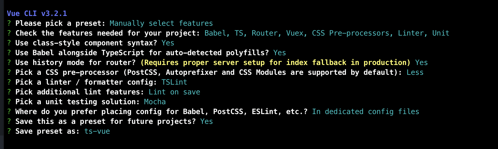
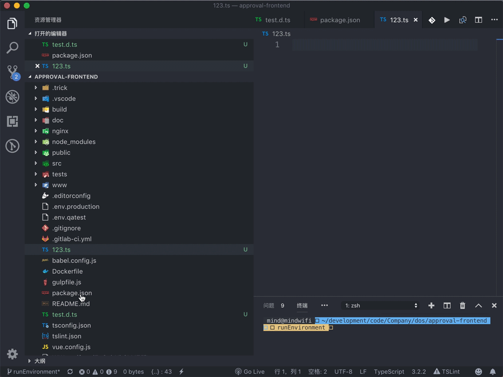

# TypeScript

## 基础知识点

基础类型: number string boolean array object

### 1. enum: 枚举 ✅

```ts
enum Color { Red = 1, Green = 2, Blue = 3 }
let c: Color = Color.Blue
```

### 2. type 和 interface ✅

```ts
// interface 拓展
interface Name {
  name: string
}
interface User extends Name {
  age: number
}

// type 交叉
type TName = {
  name: string
}
type TUser = TName & {
  age: number
}

// type 可以而 interface 不行
interface Dog {
    wong();
}
interface Cat {
    miao();
}
type Pet = Dog | Cat

// type 语句中还可以使用 typeof 获取实例的 类型进行赋值
let div = document.createElement('div');
type B = typeof div

// interface 可以而 type 不行(合并声明)
interface User {
  name: string
}
interface User {
  age: number
}
```

### 3. 联合类型 | ✅

```ts
function test (age: string | number) {
  return age
}

```

### 4. 交叉类型 & ✅

```ts
interface A {
  name: string
  age?: number
}

interface B {
  name: string
  height?: number
}

function sum (age: A & B) {
  return age
}

sum({name: 'tommy'})
```

### 5. typeof ✅

```ts
function toArray(x: number): Array<number> {
  return [x];
}

type Func = typeof toArray; // -> (x: number) => number[]
```

### 6. keyof ✅

```ts
interface Person {
  name: string;
  age: number;
}

type K1 = keyof Person; // "name" | "age"
```

### 7. in ✅

```ts
// 遍历联合类型
type Keys = "a" | "b" | "c"

type Obj =  {
  [p in Keys]: string
}

let obj: Obj = {
  a: '123',
  b: '234',
  c: '345'
}

// 遍历枚举类型
enum Color { Red = 'red', Green = 'green', Blue = 'blue' }
let c: Color = Color.Blue

type Col = {
  [key in Color]: string
}

const col: Col = {
  'red': '1',
  'green': '2',
  'blue': '3'
}
```

### 8. extends ❎

```ts
interface ILengthwise {
  length: number;
}

function loggingIdentity<T extends ILengthwise>(arg: T): T {
  console.log(arg.length);
  return arg;
}

loggingIdentity(3);
loggingIdentity({length: 10, value: 3});
```

### 9.  Partial ✅

Partial<T> 的作用就是将某个类型里的属性全部变为可选项 ?。

### 10. Required ✅

Required<T> 的作用就是将某个类型里的属性全部变为必选项。

### 11. Readonly ✅

Readonly<T> 的作用是将某个类型所有属性变为只读属性，也就意味着这些属性不能被重新赋值。

### 12. Record ✅

Record<K extends keyof any, T> 的作用是将 K 中所有的属性的值转化为 T 类型。

```ts
// 联合类型
interface PageInfo {
  title: string;
}

type Page = "home" | "about" | "contact";

const x: Record<Page, PageInfo> = {
  about: { title: "about" },
  contact: { title: "contact" },
  home: { title: "home" }
};

// 枚举
enum Page {
  HOME,
  CONTACT 
}

type PageInfo = {
  title: string
}

const x: Record<Page, PageInfo> = {
  0: { title: '123' },
  1: { title: '123' }
}
```

### 13.  Exclude ✅

Exclude<T, U> 的作用是将某个类型中属于另一个的类型移除掉。

```ts
type T0 = Exclude<"a" | "b" | "c", "a">; // "b" | "c"
type T1 = Exclude<"a" | "b" | "c", "a" | "b">; // "c"
```

### 14.  Extract ✅

Extract<T, U> 的作用是从 T 中提取出 U。

```ts
type T0 = Extract<"a" | "b" | "c", "a" | "f">; // "a"
type T1 = Extract<string | number | (() => void), Function>; // () => void

```

### 15.  Pick ✅

Pick<T,U> 从T中挑出U类型。

```ts
interface Test {
    name: string;
    sex: number;
    height: string;
}

type Sex = Pick<Test, 'sex'>;

const a: Sex = { sex: 1 };
```

### 16. 泛型

```ts
// 接口泛型
interface Generic <T> {
  name: T
}
type GA = Generic<string>
type GB = Generic<number>

const ga: GA = {name: '123'}
const gb: GB = {name: 123}


// 函数泛型
function generic<T>(arg: T[]): T[] {
  console.log(arg.length)
  return arg
}

generic([123])
generic(['tommy'])
```

### 16. 装饰器

###### 1. 类装饰器和类方法装饰器

> 类方法装饰器：
  - target：VirtualList.prototype 原型
  - name：key 类方法名
  - descriptor：Object.getOwnPropertyDescriptor(target, key) 类方法对应的描述符

> 类装饰器:
  - target：VirtualList 类本身

```js
// 类装饰器
export const test = (target: any) => {
  target.isAnimal = true;
  console.log({target})
  return target;
}

// 类方法装饰器
export const readonly = (target: any, name: string, descriptor: PropertyDescriptor) => {
  descriptor.writable = false;
  console.log('readonly')
  return descriptor;
}

// 使用
@test
export default class VirtualList extends Vue {
  @readonly
  created() {
    console.log(123)
  }
}
```

> `模拟实现 es6 的装饰器`: target、name、descriptor

```js
class Model {
  getData() {
    return new Promise((resolve, reject) => {
      setTimeout(() => {
        console.log('wait for 2 seconds')
        resolve([{
          id: 1,
          name: 'Niko'
        }, {
          id: 2,
          name: 'Bellic'
        }])
      }, 2000)
    })
  }
}

const wrap = (Model, key) => {
  // 获取Class对应的原型
  let target = Model.prototype

  // 获取函数对应的描述符
  let descriptor = Object.getOwnPropertyDescriptor(target, key)

  let log = function (...arg) {
    let start = new Date().valueOf()

    return descriptor.value.apply(this, arg).then((res) => {
      let end = new Date().valueOf()
      console.log(`start: ${start} end: ${end} consume: ${end - start}`)
      return res
    })
  }

  Object.defineProperty(target, key, {
    ...descriptor,
    value: log
  })
}

wrap(Model, 'getData')

const init = async() => {
  const model = new Model()

  const res = await model.getData()

  console.log(res)
}

init()
```

###### 2. 缓存装饰器（未考虑时效性）
```ts
const cacheMap = new Map();

export function EnableCache(target: any, name: string, descriptor: PropertyDescriptor) {
  const val = descriptor.value;
  descriptor.value = async function(...args: any) {
    const cacheKey = name + JSON.stringify(args);
    console.log('cache:', cacheMap.get(cacheKey))
    if (!cacheMap.get(cacheKey)) {
      const cacheValue = Promise.resolve(val.apply(this, args)).catch((_) => cacheMap.set(cacheKey, null));
      cacheMap.set(cacheKey, cacheValue);
      console.log({ cacheValue })
    }
    return cacheMap.get(cacheKey);
  };
  return descriptor;
}
```

###### 3. 执行时间计算装饰器

```ts
export const measure = (before?: any, after?: any) => {
  return (target: any, name: string, descriptor: PropertyDescriptor) => {
    console.log({ target, name, descriptor }, target[name])
    const oldValue = descriptor.value
    before && before()
    descriptor.value = async function() {
      const current = Date.now()
      const res = await oldValue.apply(this, arguments)
      // const res = await target[name].apply(this, arguments)
      console.log(`total time: ${Date.now() - current}`)
      return res
    }
    after && after()
    return descriptor
  }
}
```

### 17. router 的 ts 改造

```ts
enum RoutePath {
  /** 首页 */
  Index = '/',
  /** 关于页面 */
  About = '/about',
  /** 用户页面 */
  User = '/user',
}

interface IndexPageParam {
  name: string;
}

interface AboutPageParam {
  testName: string;
}

interface UserPageParam {
  userId: number;
}

type ParamsMap = {
  [RoutePath.Index]: IndexPageParam;
  [RoutePath.About]: AboutPageParam;
  [RoutePath.User]: UserPageParam;
}

function replace<T extends RoutePath>(routePath: T, params: ParamsMap[T]) {
  console.log({
    path: routePath,
    query: params,
  });
}

replace(RoutePath.User, { userId: 1 })
```


# Vue CLI 3 TypeScript 项目实践总结

## （一）创建项目

推荐创建 `vue-router, vuex, less, babel, typescript,tslint, unit-mocha` 组合的项目，相关配置选项如下：



**常见问题**：
1. 比如不需要pwa，但是创建了包含pwa的项目：
解决办法：
	- 删除掉 `public` 文件夹中，pwa 相关文件。
	- 在 `src/main.ts` 把注册 pwa 入口删掉，把 `src/registerServiceWorker.ts` 删掉
	- 在终端执行 `yarn remove @vue/cli-plugin-pwa`，把 `package.json` 中 devDependencies 里面 pwa 的 webpack 插件删掉  ，

因为 vue-cli3，的webpack插件是自动安装的，只要 `devDependencies` 有相关 webpack 插件 包就会自动安装。上述操作之后生成的 静态代码就不会包含 pwa 相关文件和代码了。

## （二）代码检查与修复

- **typescript 语法标准** :  [tslint-config-standard](https://github.com/blakeembrey/tslint-config-standard)

1. 添加 `tslint-config-standard`  校验规则 ，在项目的根目录：`yarn add tslint-config-standard -D`
2. 修改 `tslint.json` 配置文件，改成如下：

```
{
  "defaultSeverity": "warning",
  "extends": [
    "tslint-config-standard"
  ],
  "linterOptions": {
    "exclude": [
      "node_modules/**",
      "src/**/*.d.ts"
    ],
    "include": [
      "node_modules/@types"
    ]
  },
  "rules": {
    "no-debugger": true,
    "no-console": true,
    "no-floating-promises": false
  }
}
```

**特别提醒**：

```
 "linterOptions": {
    "exclude": [
      "src/**/*.d.ts"
    ],
```
linter一定要排除 typescript 的描述文件。否则 `yarn run lint` 进行语法修复时会出错，造成无法修复代码。

配置好之后，就可以在终端运行：`yarn run lint` 整个项目按照 `tslint-config-standard` 标准 进行代码修复。**注意：**只会修复 `typescript文件` 和 `Vue组件中的 script 中的 typescript 代码`


##（三）配置 pre-commit 在 git 提交前进行代码修复

1. 添加 `pre-commit` 包到项目，在项目根目录：`yarn add pre-commit -D`
2.  配置 `package.json` 执行静态文件代码修复

```
// package.json
  "scripts": {
    "serve": "vue-cli-service serve",
    "build": "vue-cli-service build",
    "lint": "vue-cli-service lint",
    "test:unit": "vue-cli-service test:unit"
  },
  "pre-commit": [
    "lint"
  ]
```

配置后之后，我们每次 git 提交都会对项目代码进行 `tslint-config-standard` 修复，把不符合标准的写法修复正确。修复后需要重新 填写 git message。


## （四）构建环境和运行环境处理

温馨提示，由于 vue-cli3 构建代码中 `process.env.NODE_ENV` 代码相关逻辑是写死的，**为了保证 线上环境和测试构建规则一致**，这2个环境需要主动设置 `process.env.NODE_ENV` 的值为 `production`。

添加 **构建环境变量**  `process.env.BUILD_ENV`，作用是在构建中 启用或关闭一些 线上环境和测试环境不同的代码。比如 `sentry` 、`CDN` 等，这些都是线上环境需要的。而 `DEBUG`、`Mock` 这些测试环境才需要。所以需要 构建环境变量来启用或关闭

添加 **运行环境判断方法**，作用是：因为构建的线上代码也同样可以部署到测试环境。当有 运行环境变量。就可以通过判断当前访问域名是线上域名还是测试域名。从而动态改变代码相关逻辑。比如：把构建线上代码部署到测试环境 ，测试 `Ajax` 请求地址应该也为测试环境的域名才对。

**相关步骤：**

（1）. 在项目根目录创建 `.env.production` 和  `.env.qatest` 这两个构建环境变量设置文件

`.env.production`的值为：
```
NODE_ENV=production
BUILD_ENV=production
```

`.env.qatest`的值为：
```
NODE_ENV=production
BUILD_ENV=testing
```

（2）. 修改 `package.json` 文件，指定  `.env.production` 和  `.env.qatest` 为 `yarn build` 和 `yarn build:test` 的 mode 参数

只需要传入名称 production 和 qatest 即可
```
"scripts": {
    "serve": "vue-cli-service serve",
    "build:test": "vue-cli-service build --mode qatest",
    "build": "vue-cli-service build --mode production",
	...
  },
```

（3）. 在 `vue.config.js` 里面 根据 `BUILD_ENV` 进行相关构建设置。举例：

```js
const webpack = require('webpack')
const pkg = require('./package.json')
const registrySentryPlugin = function(baseUrl) {
  const SentryPlugin = require('webpack-sentry-plugin')
    return new SentryPlugin({
    include: /\.js(\.map)?$/,
    ignore: ['node_modules'],
    project: pkg.name,
    organization: 'lixin',
    apiKey: '2629b3fdf8754468a6caf19840b3a575eb9aa43339d44460855a2356c9d0d4e4',
    release: pkg.version,
    baseSentryURL: 'https://sentry.lixinio.com/api/0',
    deleteAfterCompile: true, // 编译后是否删除本地的sourcemap
    suppressConflictError: true, // 压制重复上传的冲突，以防抛出错误
    filenameTransform: function (filename) { // 自定义需要输出的文件名
      var urlObj = require('url').parse(baseUrl)
      return '~' + urlObj.pathname.replace(/\/+$/, '') + '/' + filename
    }
  })
}

/**
 * 因为 vue-cli 使用 webpack 打包代码是通过  process.env.NODE_ENV 来区分打包的
 * 为了保证 生产环境和测试环境打包规则一致。所以测试环境下 process.env.NODE_ENV 跟 生产环境一致 为 production：线上环境
 * 增加新的环境变量 process.env.BUILD_ENV 做为当前构建环境的标志
 * process.env.BUILD_ENV的值：
 * production：线上
 * testing：测试
 */
const isProduction = process.env.BUILD_ENV === 'production';
// 是否为测试环境
const isTesting = process.env.BUILD_ENV === 'testing'
const baseUrl = 'https://g.lxstatic.com/dos/approval/';
module.exports = {
  // 线上环境需要使用 CDN项目地址 作为 baseUrl
  baseUrl: isProduction ?  baseUrl: '/',
  outputDir: 'www',
  configureWebpack: config => {
    const customConfig = {}
    customConfig.plugins = [
      // 环境变量
      new webpack.DefinePlugin({
        'process.env.SENTRY_TEST': JSON.stringify(false), // 控制sentry测试
        'process.env.PROJECT_VERSION': JSON.stringify(pkg.version),
        'process.env.NODE_ENV': JSON.stringify(process.env.NODE_ENV),
        'process.env.BUILD_ENV': JSON.stringify(process.env.BUILD_ENV)
      })
    ]
    // 保证测试环境和生产环境打包规则一致
    if (isProduction || isTesting) {
      customConfig.optimization = {
        splitChunks: {
          cacheGroups: {
            vue: {
              test: /[\\/]node_modules[\\/](vue|vuex|vue-router)[\\/]/,
              priority: -8,
              name: 'vue',
              chunks: 'all'
            },
            cvux: {
              test: /[\\/]node_modules[\\/](cvux)[\\/]/,
              priority: -9,
              name: 'cvux',
              chunks: 'all'
            },
            vendors: {
              test: /[\\/]node_modules[\\/]/,
              priority: -10,
              name: 'vendors',
              chunks: 'all'
            },
            default: {
              minChunks: 2,
              priority: -20,
              reuseExistingChunk: true
            }
          }
        }
      }
      // sentry插件
      customConfig.plugins.push(registrySentryPlugin(baseUrl))
      // 保证未修改的文件的hash值一致
      customConfig.plugins.push(new webpack.HashedModuleIdsPlugin())
    }

    return customConfig
  }
}

```

（4）. 在`src/main.ts` 里面 使用 BUILD_ENV 控制 mock 和 debug 的启用

```js
import './common/flexible'
...
// 构建环境为非正式环境开始debug模式
if (process.env.BUILD_ENV !== 'production') {
  import('@/debug')
  import('@/mock/index')
}
...
```

（5）.  在 sentry 插件入口控制 sentry 的启用

```js

/**
 * 数据上报
 */
import Vue from 'vue'
import * as Sentry from '@sentry/browser'
import config from './config'

// 构建环境为开发环境和测试环境时，sentry关闭上报
if (config.environment === 'production') {
  Sentry.init({
    ...config,
    integrations: [new Sentry.Integrations.Vue({ Vue })]
  })
  Vue.prototype.$report = Sentry
}

```

（6）. 添加运行环境判断方法，通过访问的域名来判断是否为线上域名。在需要使用的地方调用判断即可。

```js
export default {
/**
   * isProductionEnv() 函数用于判断当前访问的域名是正式环境还是测试环境
   * return { boolean } true 正式环境/测试环境
   */
  isProductionEnv () {
    // 线上环境运行域名
    return 'fa.prod.dos.cheanjia.net' === window.location.host
  }
 }
```


## （五）快速生成后端接口描述对象。

vs code 扩展：`Paste JSON as Code` ，能够读取剪贴板内的内容，如果符合json格式，就会在你的鼠标所在的 ts 文件 追加生成 相应的 interface 描述代码。

https://marketplace.visualstudio.com/items?itemName=quicktype.quicktype

安装好扩展后：

1. 右键全选复制后端接口JSON数据
2. 打开需要粘贴的 typescript 文件
3. 按下 Ctrl/command + shift + p ，找到 `Paste JSON as Code` 或者 `Paste JSON as Types` ，然后再按回车。就会在你鼠标光标处追加生成的 interface 描述文件。


