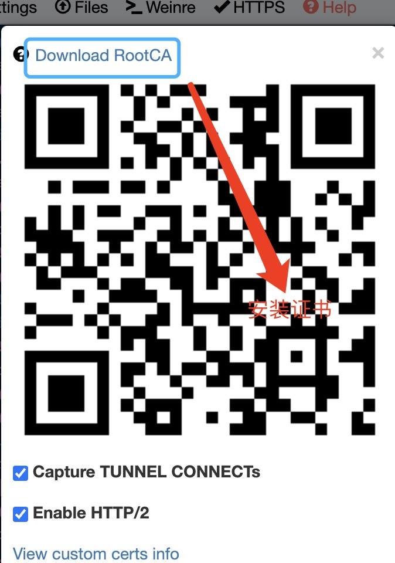
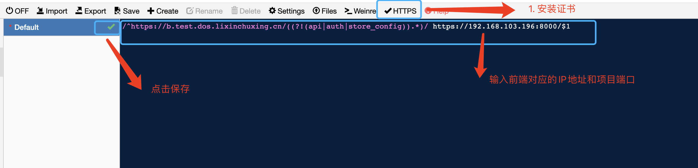
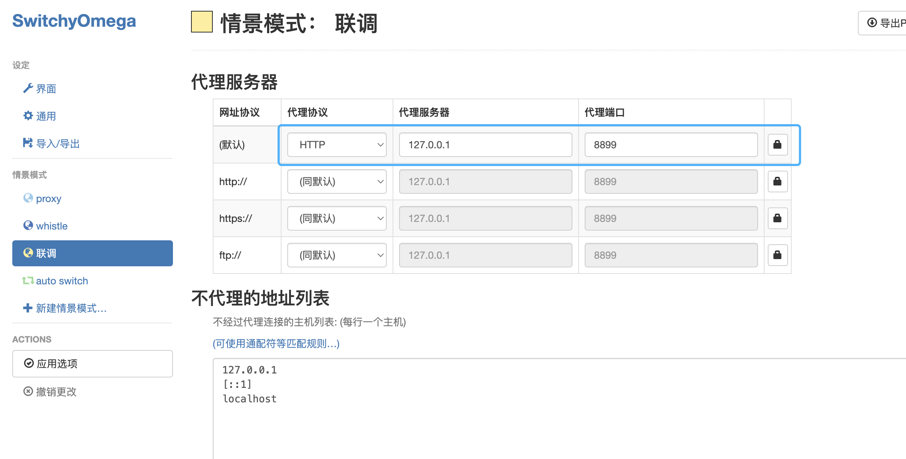
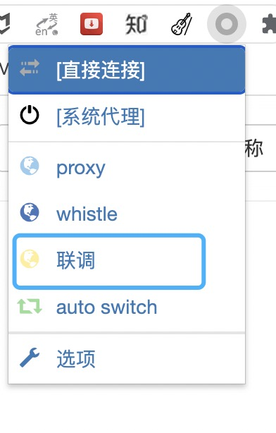
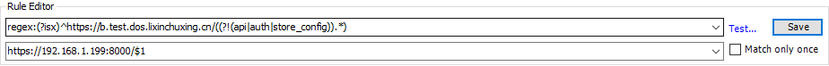
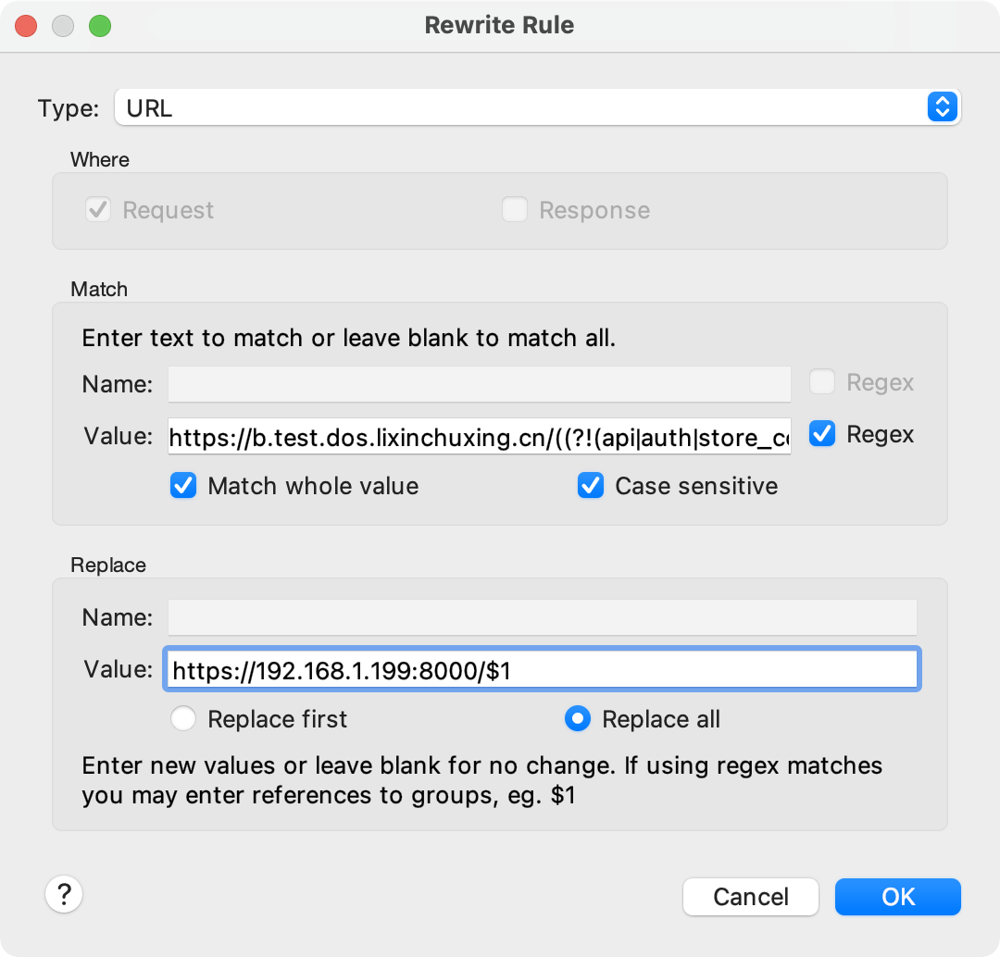

#### 联调后端或者产品测试访问前端本地项目的方式

### merchant-frontend为例

### 前端:
  
##### 一. 运行项目 npm run dev 获取Network https://192.168.106.196:8000

##### 二. 关闭防火墙 或者 打开指定端口供外部访问
* __关闭防火墙__
  1. Windows系统
    - windows + q -> 控制面板
    - 系统与安全
    - Windows防火墙
    - 启用或者关闭Windows防火墙
    - 部份情况需要禁用 Security Center
  2. mac系统(保证防火墙选项阻止所有传入链接不勾选，即可)
    - mac 只禁止1024以下的端口访问，超过1024端口若不关闭权限可以访问
* __打开指定端口外部访问权限 8000 为列__
  1. windows系统
    - windows + q -> 控制面板
    - 系统与安全
    - windows防火墙
    - 高级设置
    - 入站规则 -> 右侧新建规则
    - 选择端口 下一步
    - 特定本地端口 输入8000端口 保存

  2. mac 系统（10.6版本 ipfw?）mac 系统较高版本禁用了1024端口以下的访问
    但是就算打开防火墙，超过1024的端口也可以在外部访问
    所以mac 电脑只要运行之后将url告诉对应的访问者就可以了。
    保证防火墙选项阻止所有传入链接不勾选
    - 打开 Terminal 
    - sudo -i
    - pfctl -d 结束pfctl
    - vim /etc/pf.conf
    - 将"pass in inet proto tcp from any to any port 8000 no state" 添加到最后一行
    - 保存退出vim
    - pfctl -f /etc/pf.conf  载入修改
    - pfctl -e 开始pfctl

### 访问者: 使用 （whistle + SwitchOmeoga） 或者 fiddle 或者 Charles

* __使用 whistle(npm 包) + SwitchyOmega(谷歌浏览器插件)__
  1. 安装[node](http://nodejs.cn/)
  2. npm install whistle -g
  3. 打开Terminal -> w2 start
  4. open link http://192.168.x.xxx:8899/
  5. 点击安装证书
  
  6. 设置正则替换
  
  7. 安装谷歌插件 SwitchOmeoga
  8. 点击选项进入设置SwitchOmeoga
  
  9. 选择设置的情景模式
  
  10. 当需要访问前端对应项目 命令行工具 w2 start + 步骤6  + 步骤9
* __使用 fiddle 或者 Charles__
  1. 安装fiddle 或者 Charles
  2. 安装证书
  3. 设置配置可代理
  4. 将前端交与的正则填入到对应的配置中
    

  
