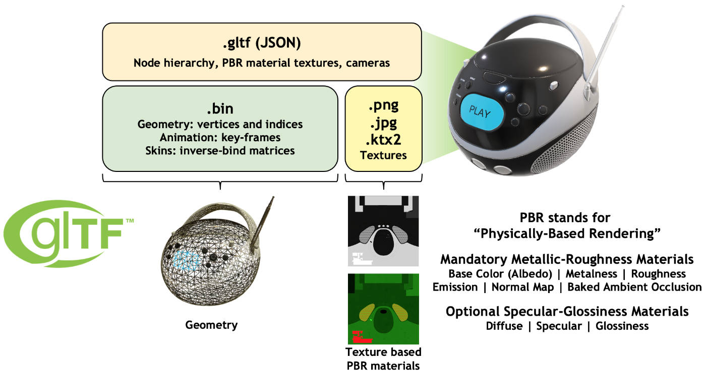

# glTF

> glTF is the "JPEG of 3D"

## glTF 文件结构

## glTF 内部结构详解

> https://blog.csdn.net/qq_31709249/article/details/86477520

- scenes：

- nodes：

- buffers：

- bufferViews：

- accessors：

- meshes：

- materials：

- textures：

## glTF 生态

