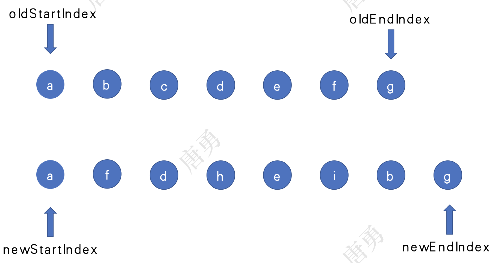

# vue-diff 算法

## vue2.0

【如图，上面的节点为旧节点，下面的为新节点，diff 算法的本质就是比较两个数组的不同，从而只更新不同的地方：旧节点没有而新节点有就新增，旧节点有而新节点没有就删除】

- step-1: 首先从新旧两个数组的起始位置开始比较，如果有相同节点（a = a），则移动指针。

- step-2: 两个数组的起始位置找不到相同的节点（b != f），则从数组的尾部位置开始比较（g = g）。

- step-3: 头头比较，尾尾比较都找不到相同的节点，则头尾比较（b = b）。

- step-4: 头尾比较找不到相同的节点（c != i），则尾头比较（f = f）。

- step-5: 头头比较，尾尾比较，头尾比较，头尾比较都找不到相同的节点，则给旧数组剩余的节点创建 key 值到下标的映射表（oldKeyIndex = {c: 2, d: 3, e: 4}），然后遍历新数组剩余的节点，如果对应节点的映射存在（oldKeyIndex[d]），则将旧数组对应节点设置为 undefined。

- step-6: 继续遍历，oldKeyIndex[h]不存在，则新增这个节点。

- step-7: 循环结束的条件：新节点数组的newStartIndex > newEndIndex，此时旧节点数组还存在的直接删除。


## vue3.0

第一步和第二步与 vue2.0 完全相同，不进行头头比较和头尾比较，直接寻找最长递增子序列，最大程度保留相对顺序没有改变的元素位置，只对剩余元素进行移位。

> 最长递增子序列 leetcode 题目：https://leetcode.cn/problems/longest-increasing-subsequence/

> 动态规划解法如下：

```js
/**
 * @param {number[]} nums
 * @return {number}
 */
var lengthOfLIS = function(nums) {
    if (nums.length === 0) {
        return 0
    }
    const dp = new Array(nums.length).fill(1)
    for (let i = 1; i < nums.length; i++) {
        for (let j = 0; j < i; j++) {
            if (nums[i] > nums[j]) {
                dp[i] = Math.max(dp[j] + 1, dp[i])
            }
        }
    }
    return  Math.max(...dp)
};
```

## vue3.0 diff 算法求最长递增子序列源码

> 输入参数[11，3，5，9，7]，执行函数返回的结果为[1，2，4]

> getSequence([11，3，5，9，7]) => [1，2，4]

```js
function getSequence(arr) {
  const p = arr.slice()                 //  拷贝原始数据并保存
  const result = [0]                    //  存储最长增长子序列的索引数组
  let i, j, u, v, c
  const len = arr.length
  for (i = 0; i < len; i++) {
    const arrI = arr[i]
    if (arrI !== 0) {
      j = result[result.length - 1]     //  j是子序列索引最后一项
      if (arr[j] < arrI) {              //  如果arr[i] > arr[j], 当前值比最后一项还大，可以直接push到索引数组(result)中去
        p[i] = j                        //  p记录第i个位置的索引变为j
        result.push(i)
        continue
      }
      u = 0                             //  数组的第一项
      v = result.length - 1             //  数组的最后一项
      while (u < v) {                   //  如果arrI <= arr[j] 通过二分查找，将i插入到result对应位置；u和v相等时循环停止
        c = ((u + v) / 2) | 0           //  二分查找 
        if (arr[result[c]] < arrI) {
          u = c + 1                     //  移动u
        } else {
          v = c                         //  中间的位置大于等于i,v=c
        }
      }
      if (arrI < arr[result[u]]) {
        if (u > 0) {
          p[i] = result[u - 1]          //  记录修改的索引
        }
        result[u] = i                   //  更新索引数组(result)
      }
    }
  }
  u = result.length
  v = result[u - 1]
  //把u值赋给result  
  while (u-- > 0) {                     //  最后通过p数组对result数组进行进行修订，取得正确的索引
    result[u] = v
    v = p[v];                        
  }
  return result
}

```