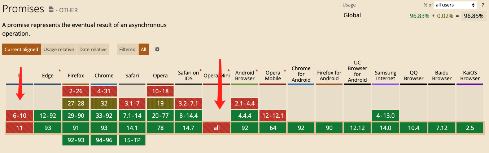
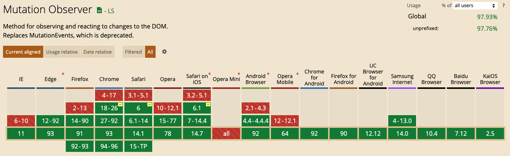
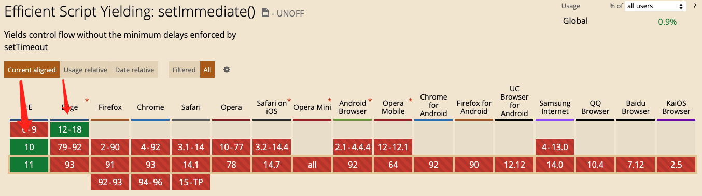
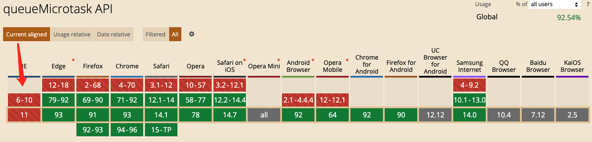

# nextTick

## 应用场景

> 需要在视图更新之后，基于新的视图进行操作

- 点击按钮显示原本以 v-show = false 隐藏起来的输入框，并获取焦点

```js
handleShow(){
  this.showit = true //修改 v-show
  document.getElementById("keywords").focus()  //在第一个 tick 里，获取不到输入框，自然也获取不到焦点
}
```

修改为：

```js
handleShow(){
  this.showit = true
  this.$nextTick(function () {
    // DOM 更新了
    document.getElementById("keywords").focus()
  })
}
```

- 点击获取元素宽度

```html
<div id="app">
    <p ref="myWidth" v-if="showMe">{{ message }}</p>
    <button @click="getMyWidth">获取p元素宽度</button>
</div>
<script>
getMyWidth() {
    this.showMe = true;
    //this.message = this.$refs.myWidth.offsetWidth;
    //报错 TypeError: this.$refs.myWidth is undefined
    this.$nextTick(()=>{
        //dom元素更新后执行，此时能拿到p元素的属性
        this.message = this.$refs.myWidth.offsetWidth;
  })
}
</script>
```

## 原理

> 源码 【vue / src / core / util / next-tick.js 42行】

```js
if (typeof Promise !== 'undefined' && isNative(Promise)) {
  const p = Promise.resolve()
  timerFunc = () => {
    p.then(flushCallbacks)
    if (isIOS) setTimeout(noop)
  }
  isUsingMicroTask = true
} else if (!isIE && typeof MutationObserver !== 'undefined' && (
  isNative(MutationObserver) ||
  MutationObserver.toString() === '[object MutationObserverConstructor]'
)) {
  let counter = 1
  const observer = new MutationObserver(flushCallbacks)
  const textNode = document.createTextNode(String(counter))
  observer.observe(textNode, {
    characterData: true
  })
  timerFunc = () => {
    counter = (counter + 1) % 2
    textNode.data = String(counter)
  }
  isUsingMicroTask = true
} else if (typeof setImmediate !== 'undefined' && isNative(setImmediate)) {
  timerFunc = () => {
    setImmediate(flushCallbacks)
  }
} else {
  timerFunc = () => {
    setTimeout(flushCallbacks, 0)
  }
}
```

> 疑问一：源码中看到了 MutationObserver，vue 是用 MutationObserver 监听 dom 变化的吗？

- 显然不是, MutationObserver 只是异步队列控制方式中的一种

> 疑问二：Promise、MutationObserver、setImmediate、setTimeout 为什么能监听 dom 更新？

- <font color=#0099ff size=12 face="黑体">每次 event loop 的最后，会有一个 UI render 步骤，也就是更新 DOM。</font>

- <font color=red size=16 face="黑体">其实，UI render 本身是一个宏任务。事件循环的初始状态：调用栈空。micro 队列空，macro 队列里有且只有一个 script 脚本（整体代码）。执行完script 脚本代码，再执行微任务，最后 UI render。然后进入下一次事件循环...</font>

> 疑问三：Promise、MutationObserver、setImmediate、setTimeout 为什么要有这么多降级处理？

- Promise：最优的 microtask 策略，是ES6新增的东西，存在兼容问题



- MutationObserver: 是 HTML5 新增的特性，在 iOS 上尚有 bug



- setImmediate: 是 macrotask 最理想的方案了，可惜的是只有 IE 和 nodejs 支持



- setTimeout: setTimeout执行的最小时间间隔是约4ms的样子，略微有点延迟。

> 疑问四：为什么不使用 queueMicrotask ？

- 这货兼容性远不如 MutationObserver



> 结论：vue 用异步队列的方式来控制 DOM 更新和 nextTick 回调先后执行

- microtask 因为其高优先级特性，能确保队列中的微任务在一次事件循环前被执行完毕

- 因为兼容性问题，vue 不得不做了 microtask 向 macrotask 的降级方案

- Promise -> MutationObserver -> setImmediate -> setTimeout
